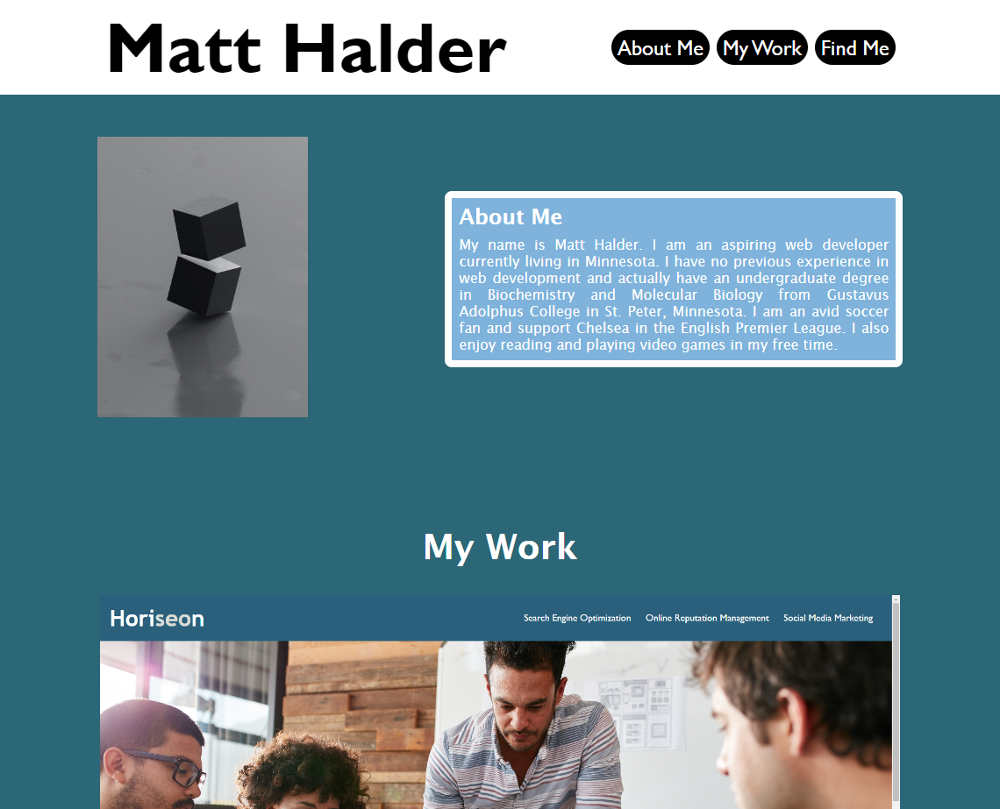

# Matt Halder's Coding Portfolio

## Description

This project was created to display items pertinent to myself (Matt Halder) in a portfolio style. There is an "About Me" section that gives some information on me, a "My Work" section that shows off my projects with links to the projects, and a "Find Me" section that has some contact info linked. The page is styled using CSS and adaptive to different screen sizes.

## Installation

The pertinent files for the project, including this README can all be found in the Github repository located at: https://github.com/mhalder4/portfolio-challenge. The website can be found at the Github pages address that follows: https://mhalder4.github.io/portfolio-challenge/.
## Usage

The website has a navigation bar along the top that directs to the sections below. The images in the "My Work" section can be clicked to be taken to those projects and the icons at the bottom can be clicked to be taken to the corresponding location.
    

## Credits

N/A

## License

MIT License

Copyright (c) 2023 Matthew Halder

Permission is hereby granted, free of charge, to any person obtaining a copy
of this software and associated documentation files (the "Software"), to deal
in the Software without restriction, including without limitation the rights
to use, copy, modify, merge, publish, distribute, sublicense, and/or sell
copies of the Software, and to permit persons to whom the Software is
furnished to do so, subject to the following conditions:

The above copyright notice and this permission notice shall be included in all
copies or substantial portions of the Software.

THE SOFTWARE IS PROVIDED "AS IS", WITHOUT WARRANTY OF ANY KIND, EXPRESS OR
IMPLIED, INCLUDING BUT NOT LIMITED TO THE WARRANTIES OF MERCHANTABILITY,
FITNESS FOR A PARTICULAR PURPOSE AND NONINFRINGEMENT. IN NO EVENT SHALL THE
AUTHORS OR COPYRIGHT HOLDERS BE LIABLE FOR ANY CLAIM, DAMAGES OR OTHER
LIABILITY, WHETHER IN AN ACTION OF CONTRACT, TORT OR OTHERWISE, ARISING FROM,
OUT OF OR IN CONNECTION WITH THE SOFTWARE OR THE USE OR OTHER DEALINGS IN THE
SOFTWARE.